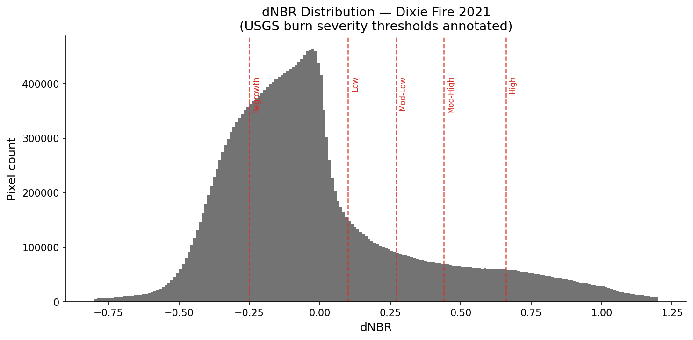

# 🔥 Burn Area Detection Using Sentinel-2 Imagery
### Dixie Fire 2021 · Plumas County, California

A reproducible pipeline for detecting and mapping burned areas from satellite imagery using spectral indices and machine learning. Built as a portfolio project demonstrating end-to-end remote sensing + ML skills for geospatial AI roles.

---

## Overview

This project detects burned areas from the **2021 Dixie Fire** — the largest single wildfire in California history (~963,000 acres) — using **Sentinel-2 Surface Reflectance imagery** and two complementary methods:

| Method | Approach | Strength |
|---|---|---|
| **Threshold** | USGS dNBR thresholds (Key & Benson 2006) | Fast, interpretable, industry standard |
| **Random Forest** | Supervised ML on 16 spectral features | Captures non-linear patterns, handles mixed pixels |

The comparison between methods is the core analytical contribution of this project.

---

## Why This Fire, This Sensor?

**2021 Dixie Fire:**
- Largest single (non-complex) fire in California history → large, well-defined burn scar
- Well-documented containment dates and official CAL FIRE perimeter → enables quantitative validation
- Mixed forest/shrubland cover → tests classifier robustness across vegetation types

**Sentinel-2:**
- 10–20m spatial resolution (vs Landsat's 30m) → finer burn boundary delineation
- 5-day revisit with two satellites → more cloud-free options around fire dates
- SWIR bands (B11, B12) required for NBR computation are reliable and well-calibrated

---

## Methodology

### 1. Imagery Acquisition (Google Earth Engine)

Cloud-free median composites from `COPERNICUS/S2_SR_HARMONIZED`:

| Composite | Date Range | Rationale |
|---|---|---|
| Pre-fire | May 1 – Jul 10, 2021 | Peak greenness before ignition (Jul 13) |
| Post-fire | Oct 26 – Nov 30, 2021 | After full containment (Oct 25); before Sierra Nevada snow |

Cloud masking uses the **QA60 band** (Bits 10 + 11), with reflectance scaled to [0, 1].  
Export: 20m resolution, UTM Zone 10N (EPSG:32610), GeoTIFF via Google Drive.

### 2. Spectral Indices

| Index | Formula | Purpose |
|---|---|---|
| **NBR** | (B8 − B12) / (B8 + B12) | Core burn signal |
| **dNBR** | pre_NBR − post_NBR | Change detection |
| **RdNBR** | dNBR / √\|pre_NBR\| | Vegetation-normalised severity (Miller & Thode 2007) |
| **NDVI** | (B8 − B4) / (B8 + B4) | Vegetation greenness |
| **NDWI** | (B3 − B8) / (B3 + B8) | Canopy moisture |
| **BAI** | 1 / ((0.1−B4)² + (0.06−B8)²) | Char signature detection |

**Why B12 (not B11) for NBR?**  
B12 at 2190nm is more sensitive to moisture and char than B11 at 1610nm. USGS recommends B12 for Sentinel-2 NBR computation.

**Why RdNBR?**  
Standard dNBR systematically underestimates severity in sparse vegetation (low pre-fire NBR baseline). RdNBR normalises by pre-fire biomass density, making burn severity estimates comparable across forest and shrubland ([Miller & Thode 2007](https://doi.org/10.1016/j.rse.2006.08.027)).



### 3. Threshold Classification

USGS burn severity thresholds (Key & Benson 2006):

| dNBR Range | Severity Class |
|---|---|
| < −0.25 | Enhanced Regrowth |
| −0.25 – 0.10 | Unburned |
| 0.10 – 0.27 | Low Severity |
| 0.27 – 0.44 | Moderate-Low Severity |
| 0.44 – 0.66 | Moderate-High Severity |
| > 0.66 | High Severity |

### 4. Random Forest Classifier

**Features (16):** Pre-fire NBR, NDVI, NDWI, BAI, B4, B8, B12 + post-fire equivalents + dNBR + RdNBR  
**Labels:** dNBR > 0.27 proxy labels from GEE stratified sample (5,000 burned + 5,000 unburned)  
**Training:** 80/20 stratified split + 5-fold cross-validation  

Key hyperparameter choices:
- `n_estimators=200` — stable OOB error, diminishing returns beyond ~300
- `max_depth=20` — prevents overfitting to noisy cloud-edge pixels
- `class_weight='balanced'` — burned pixels are minority class (~15–30% of AOI)
- `oob_score=True` — free internal validation without touching test set

---

## Results

| Metric | Threshold | Random Forest |
|---|---|---|
| Burned area detected | ~803,000 ha | ~868,000 ha |
| F1 Score | — | 0.99 (proxy labels) |
| ROC-AUC | — | 0.9997 |
| Method agreement | — | 77.1% |
| Decision threshold | dNBR ≥ 0.27 | prob ≥ 0.255 |

**Spatial validation against CAL FIRE official perimeter: ~98% of the perimeter falls within the predicted burn boundary.**

### Key Findings

Both methods correctly identify the core burn zone across Plumas and Butte counties. The RF detects ~65,000 ha more than the threshold method — visual inspection suggests this additional area corresponds to low-severity burns where dNBR falls just below 0.27 but the combined spectral signal across 16 bands is consistent with fire damage.

The 77.1% pixel-level agreement between two independently-calibrated methods on a fire of this complexity is the primary validation metric, since training labels are dNBR-derived proxies rather than field-validated ground truth.

### Known Limitations

| Issue | Location | Technical cause | Fix |
|---|---|---|---|
| Northern underestimation | ~Lassen boundary | Dense closed-canopy conifer suppresses NIR drop, keeping dNBR below threshold | Add Sentinel-1 SAR bands |
| Northeast false positives | ~Antelope Lake | Dry late-season grassland is spectrally similar to burned vegetation | Add NDWI pre-fire moisture filter |
| Proxy labels | Training data | Labels derived from dNBR itself — circular if dNBR is also a feature | Replace with CAL FIRE FRAP perimeter as hard ground truth |
| No spatial CV | Evaluation | Random train/test split ignores spatial autocorrelation → optimistic F1 | Implement block cross-validation |

---

## Repository Structure

```
burn-area-mapping/
├── src/
│   ├── gee_export.py       # GEE imagery acquisition + export
│   ├── indices.py          # Spectral index computation (local/rasterio)
│   ├── classifier.py       # Threshold + RF classifiers
│   ├── visualise.py        # Folium map + matplotlib figures
│   └── pipeline.py         # End-to-end run script
├── notebooks/
│   └── analysis.ipynb      # Exploratory analysis + step-by-step walkthrough
├── data/
│   ├── raw/                # Downloaded GeoTIFFs (gitignored)
│   ├── processed/          # Analysis stack GeoTIFF (gitignored)
│   └── samples/            # Training samples CSV (gitignored)
├── outputs/
│   ├── figures/            # PNG figures for README/report
│   └── maps/               # Interactive Folium HTML map
├── tests/
│   └── test_indices.py     # Unit tests for index computation
├── requirements.txt
└── README.md
```

---

## Quickstart

### Prerequisites
- Python 3.10+
- Google Earth Engine account (free) with a Cloud project
- ~500MB free disk space for GeoTIFF downloads

### Setup

```bash
git clone https://github.com/YOUR_USERNAME/burn-area-mapping.git
cd burn-area-mapping

python -m venv .venv
source .venv/bin/activate          # Windows: .venv\Scripts\activate
pip install -r requirements.txt

# Authenticate GEE (one-time)
earthengine authenticate
```

### Step 1 — Export imagery from GEE

```bash
python -m src.gee_export your-gee-project-id
```

Monitor export progress at https://code.earthengine.google.com/tasks.  
Download the 4 output files from Google Drive into `data/raw/`, `data/processed/`, and `data/samples/`.

### Step 2 — Run the full pipeline

```bash
python -m src.pipeline \
    --stack   data/processed/analysis_stack_dixie2021.tif \
    --samples data/samples/training_samples_dixie2021.csv \
    --out     outputs/
```

### Step 3 — Open the interactive map

```bash
open outputs/maps/burn_map_interactive.html    # macOS
xdg-open outputs/maps/burn_map_interactive.html  # Linux
```

---

## Relevance to Physical Risk & EO Applications

This pipeline addresses a real workflow used by:

- **CAL FIRE / USFS BAER teams** — rapid post-fire damage assessment using dNBR thresholding
- **Physical risk analysts (e.g. MSCI)** — fire-exposed asset mapping for ESG and insurance risk models
- **AgriTech / crop monitoring (e.g. Satsure, Cropin)** — change detection methodology is directly transferable to crop damage mapping
- **EO analytics platforms (e.g. Pixxel, GalaxEye)** — satellite imagery processing pipeline with production-ready structure

The dual-method comparison (rule-based vs ML) mirrors decision frameworks used in operational remote sensing: threshold methods for speed and interpretability, ML for accuracy in heterogeneous landscapes.

---

## Limitations & Future Work

| Limitation | Planned Improvement |
|---|---|
| dNBR proxy labels (not field-validated) | Add CAL FIRE FRAP perimeter polygons as hard ground truth |
| No spatial cross-validation | Implement block CV to account for spatial autocorrelation |
| Static snapshot (one fire) | Extend to multi-year, multi-fire dataset |
| 20m resolution export | Test 10m export with B4/B8 (NIR, Red) for finer boundaries |
| Binary classification only | Add multi-class severity (6 USGS classes) as RF output |

---

## References

- Key, C.H. & Benson, N.C. (2006). *Landscape Assessment: Ground measure of severity, the Composite Burn Index.* USDA Forest Service RMRS-GTR-164-CD.
- Miller, J.D. & Thode, A.E. (2007). Quantifying burn severity in a heterogeneous landscape with a relative version of the delta Normalized Burn Ratio (dNBR). *Remote Sensing of Environment*, 109(1), 66–80.
- Sentinel-2 User Handbook, ESA (2015). https://sentinel.esa.int/documents/247904/685211/Sentinel-2_User_Handbook

---

## Author

**KRITHI M S**  
ML practitioner | Geospatial AI | Climate Tech  
[LinkedIn](https://linkedin.com/in/YOUR_HANDLE) · [GitHub](https://github.com/YOUR_USERNAME)

> Built as a portfolio project demonstrating remote sensing + ML skills for Earth Observation roles.
